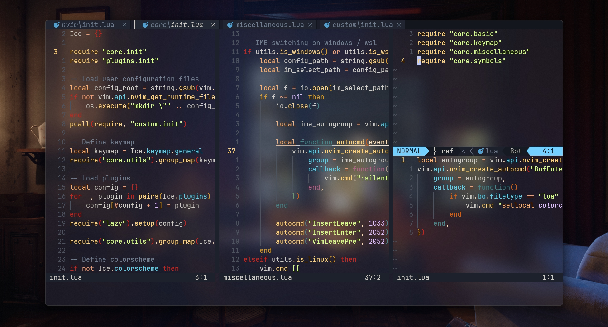
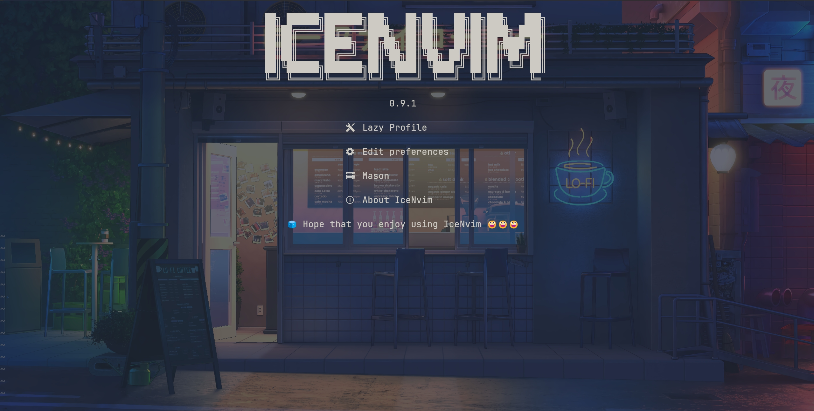
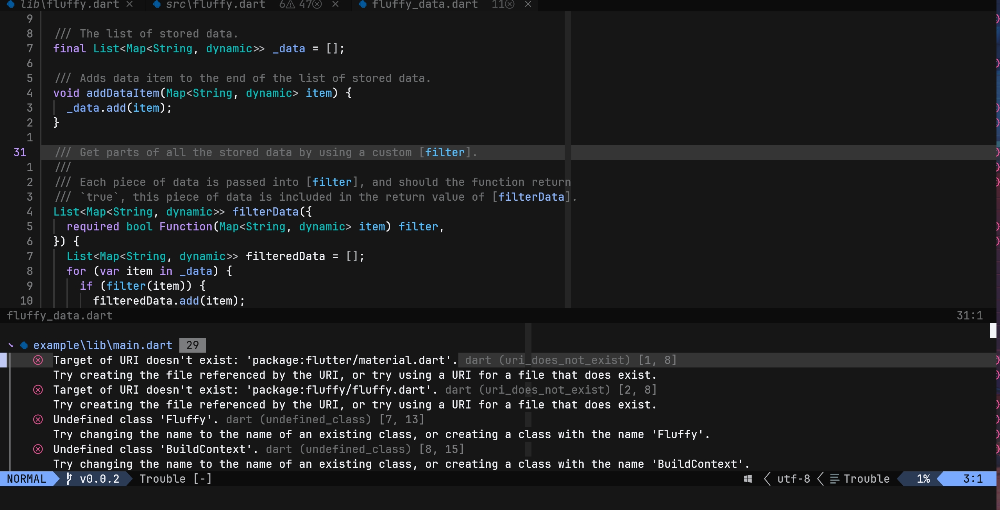
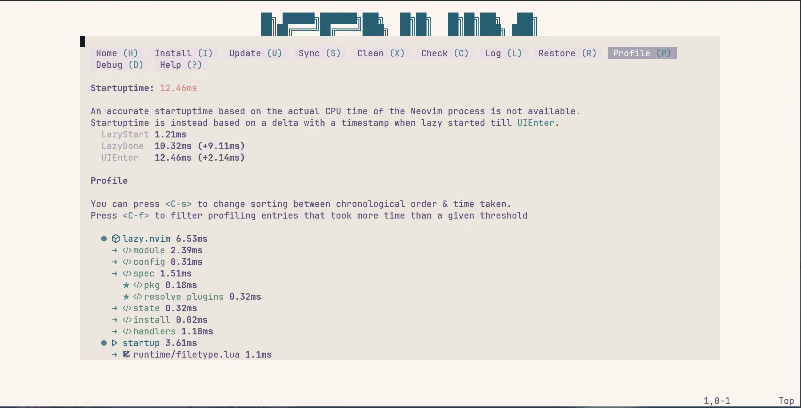

<h1 align="center">IceNvim</h1>

<div align="center">

*Please consider starring the project ✨✨✨. Your support is much appreciated.*

[](https://github.com/neovim/neovim)
[](https://github.com/neovim/neovim)
[](https://github.com/Shaobin-Jiang/IceNvim/blob/master/LICENSE)

</div>

Read this in other languages: [English](README.md) / [中文](README_zh.md)

IceNvim is a beautiful, powerful and customizable neovim config. Powerful, yet blazing fast.

For a detailed introduction on the various features of and on how to use IceNvim, refer to the [wiki](https://github.com/Shaobin-Jiang/IceNvim/wiki/Introduction).

## Showcase









## Features

- Ideal for development:
  - Set up for C# / Flutter / Lua / Python / Rust / Web development and markdown writing
  - Git integration
- Enhanced editing experience:
  - Plugins such as `hop.nvim`, `undotree` and `nvim-surround`
  - For Chinese users, automatic IME switching when changing modes (needs [additional setup](#mark-im-select))
- Nice looks:
  - Multiple colorschemes made ready
  - A custom colorschemes picker
- User friendly:
  - Uses which-key.nvim for new comers to check out keymaps
  - Provides a health check for new comers to locate missing dependencies
- Well equiped:
  - An icon viewer to check whether your font works well with icons
  - A configuration file selector
- Modern: uses `Lazy` and `Mason`
- Customizable:
  - Easily override defaults with your own [config file](#mark-custom-configuration)

## Requirements

- IceNvim requires neovim **0.10.0+** or newer
- Additionally, you need to install these also:
  - A [nerd font](https://www.nerdfonts.com/font-downloads): this is optional, but things may look funny without one installed
  - git: almost all the plugin and lsp installations depend on it
  - Required by Mason:
    - curl
    - gzip / 7zip
    - wget
  - Required by telescope:
    - fd
    - ripgrep (also required by grug-far.nvim)
  - Required by nvim treesitter:
    - gcc
    - cmake
    - node
    - npm
  - Required by markdown-preview.nvim:
    - yarn
  - Required by rustaceanvim:
    - rust-analyzer (NOT the rust-analyzer provided by Mason!!!)
  - python3 and pip3
  - Additional dependencies on Linux / WSL:
    - unzip
    - python virtual environment
    - xclip (for accessing system clipboard)
    - zip

Note that some of the packages might have different names with different package managers!

Installing dependencies on MacOS:

```bash
brew install wget fd ripgrep node yarn cmake
```

Installing dependencies on Arch:

```bash
sudo pacman -S --needed curl gzip wget fd ripgrep gcc nodejs npm python python-pip unzip zip xclip python-virtualenv
```

Installing dependencies on Windows (via scoop):

```bash
scoop install curl gzip wget fd ripgrep mingw nodejs-lts python
```

To verify if these are installed, try opening neovim with `nvim --noplugin` and then running `IceHealth` after following the installation instruction in the next section.

## Installation

On Windows:

```bash
git clone https://github.com/Shaobin-Jiang/IceNvim "$env:LOCALAPPDATA\nvim"
```

On Linux / MacOS:

```bash
git clone https://github.com/Shaobin-Jiang/IceNvim ~/.config/nvim
```

<h3 id="mark-im-select">Download `im-select.exe` (recommended for windows / wsl users)</h3>

For automatic IME switching when inputing Chinese, im-select.exe is needed.

Download it from [https://github.com/daipeihust/im-select/raw/master/win/out/x86/im-select.exe](https://github.com/daipeihust/im-select/raw/master/win/out/x86/im-select.exe) and place to the `bin` directory in the configuration directory.

Additionally, if you are using wsl, you might have to do this:

```bash
chmod +x ~/.config/nvim/bin/im-select.exe
```

### Install `macism` (recommended for MacOS users)

Macism can be installed via the command below:

```bash
brew tap laishulu/homebrew
brew install macism
```

Note that:

- The first time you use this function, MacOS will popup a window asking you to grant permission of Accessibility
- You need to enable the MacOS keyboard shortcut for "Select the previous input source", which can be found in "Preference -> Keyboard -> Shortcuts -> Input Source"

### Download `uclip.exe` (recommended for windows / wsl users)

Although text yanked from within IceNvim is already available from outside, one might find that unicode characters are not copied properly on Windows and WSL. This is because the functionality is dealt with by Windows' `CLIP` command which does a poor job when used with utf-8 characters.

To solve this, one might need to download [uclip.exe](https://github.com/suzusime/uclip/releases/download/v0.1.0/uclip.exe) and place it in the `bin` directory in the configuration directory.

Additionally, if you are using wsl, you might have to do this:

```bash
chmod +x ~/.config/nvim/bin/uclip.exe
```

<h2 id="mark-custom-configuration">Custom Configuration</h2>

This neovim configuration allows users to override the default configuration by creating a `custom` dir under `lua/`.

IceNvim will try to detect and load `custom/init.lua`. Since `custom/` is git-ignored, it will be easy for you to make your own configurations without messing up the original git repo and missing follow-up updates.

Most IceNvim config options can be found under a global variable `Ice`. The entire setup follows this routine:

- IceNvim sets its default options and store some of them, e.g., plugin config and keymaps, in `Ice`
- IceNvim loads `custom/init.lua`
- IceNvim uses `Ice` to set up plugins and create keymaps

Therefore, almost everything IceNvim defines can be re-configured by you.

An example `custom/init.lua`:

```lua
Ice.plugins["nvim-transparent"].enabled = false

Ice.keymap.general.open_terminal = { "n", "<leader>terminal", ":split term://bash<CR>" }

local autogroup = vim.api.nvim_create_augroup("OverrideFtplugin", { clear = true })
vim.api.nvim_create_autocmd("BufEnter", {
    group = autogroup,
    callback = function()
        if vim.bo.filetype == "lua" then
            vim.cmd "setlocal colorcolumn=120"
        end
    end,
})
```

## Troubleshooting

### Alt-Combination Keys Not Working in Kitty for MacOS

Add `macos_option_as_alt yes` to your `kitty.conf`.

### Installing Omnisharp / Csharpier

When installing omnisharp, make sure that dotnet sdk is installed.

When receiving nuget-related errors when installing csharpier, you might have to configure nuget source (see [https://learn.microsoft.com/zh-cn/nuget/reference/errors-and-warnings/nu1100#solution-2](https://learn.microsoft.com/zh-cn/nuget/reference/errors-and-warnings/nu1100#solution-2)):

```shell
dotnet nuget add source https://api.nuget.org/v3/index.json -n nuget.org
```

### Rust Not Working Properly

You need to check how you installed rust. I have not been able to set up rust-analyzer when installing rust only (e.g., via `scoop install rust` or `sudo zypper in rust`) either, but with the officially recommended way, i.e., by installing rustup, everything works properly.

Also, you might find that completion does not work when first opening a rust project. That is because some time needs to be taken to index the code, and completion would only work after indexing is done.

### Installation Failure for typst-preview.nvim

When installing [typst-preview.nvim](https://github.com/chomosuke/typst-preview.nvim), you might have this error: `Downloading typst-preview binary failed, exit code: 35`. This might be due to the use of proxies. Shut down softwares of such kind and run this command again:

```vim
lua require("typst-preview").update()
```

## Star History

<a href="https://star-history.com/#Shaobin-Jiang/IceNvim&Date">
 <picture>
   <source media="(prefers-color-scheme: dark)" srcset="https://api.star-history.com/svg?repos=Shaobin-Jiang/IceNvim&type=Date&theme=dark" />
   <source media="(prefers-color-scheme: light)" srcset="https://api.star-history.com/svg?repos=Shaobin-Jiang/IceNvim&type=Date" />
   
 </picture>
</a>
