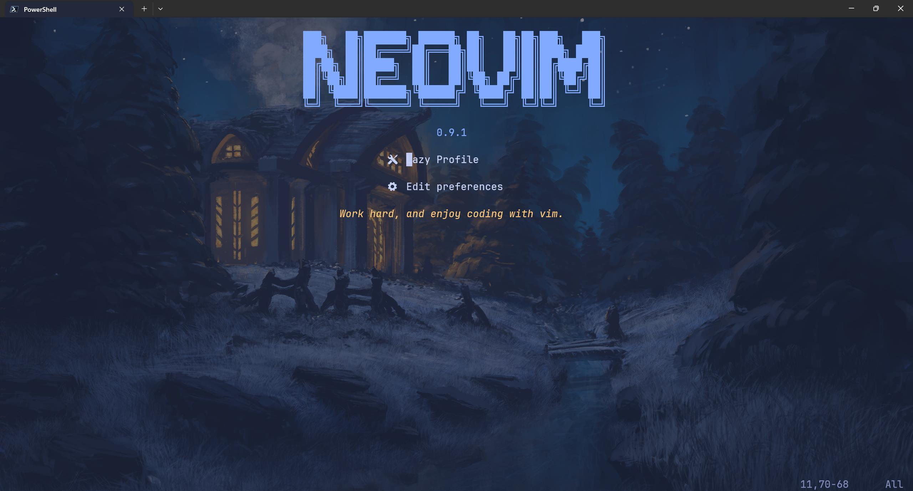
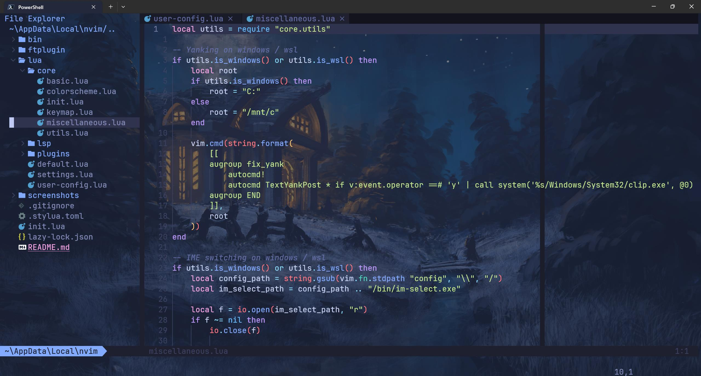
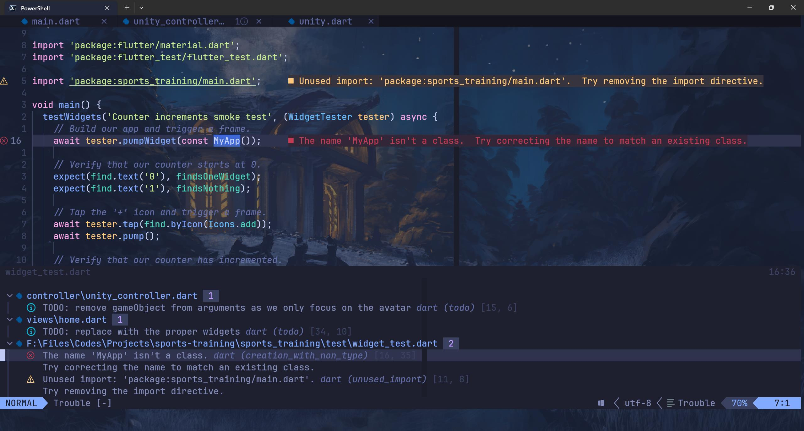
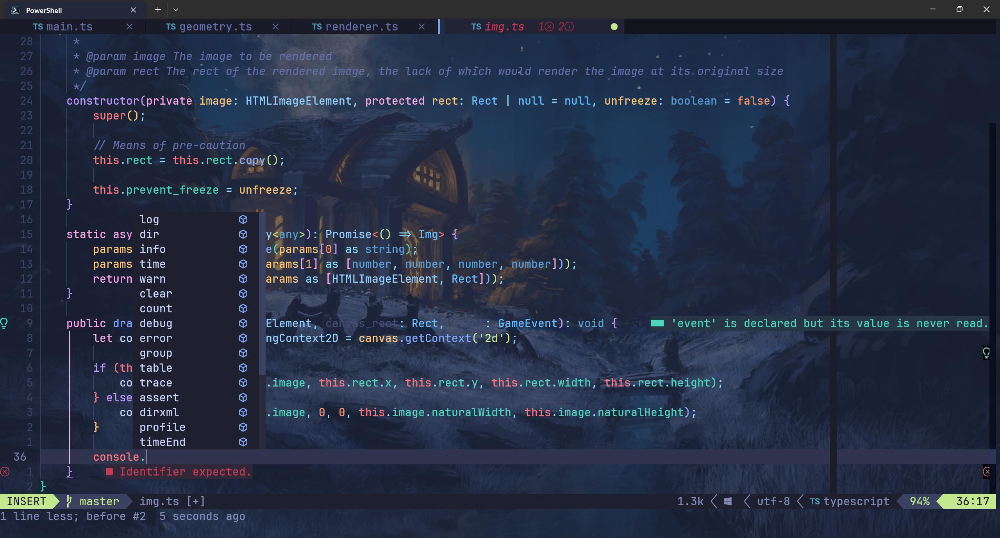
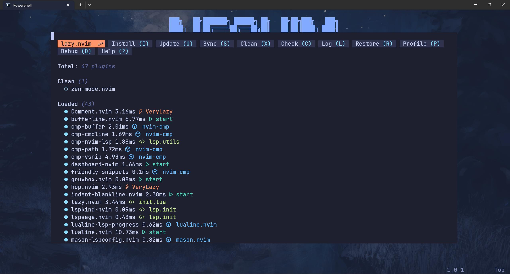
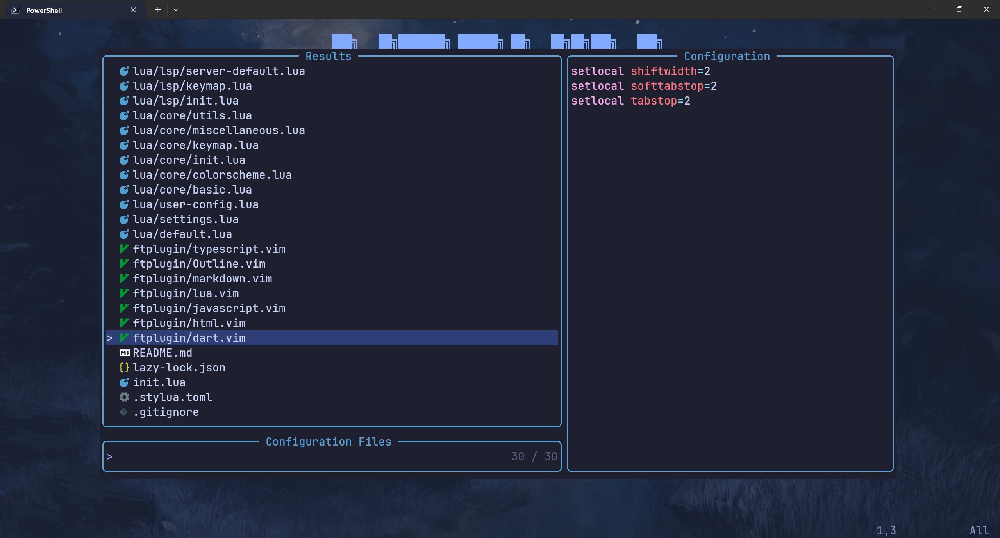

# My Neovim Configuration

This is my neovim configuration. I started using neovim for almost all of my development work in September, 2022 and it
has now been almost a year when I finally take some time to refactor my neovim configuration. I now use neovim for javascript /
typescript / python / lua / c# (unity) / dart (flutter) development and also markdown writing.

My neovim configuration might not look as fancy as other popular neovim configurations, but it better suits my need
than any existing configuration. That is what using neovim is all about, is it not, customizing it to one's personal needs?

## Screenshots

<div style="width: 100%;">
    
    
</div>
<div style="width: 100%;">
    
    
</div>
<div style="width: 100%;">
    
    
</div>

## Requirements

- This neovim configuration requires neovim **0.9.0+**
- Additionally, you need to install these also:
  - A [nerd font](https://www.nerdfonts.com/font-downloads): this is optional, but things may look funny without one installed
  - git: almost all the plugin and lsp installations depend on it
  - Required by Mason:
    - curl
    - gzip / 7zip
    - wget
  - Required by telescope:
    - fd
    - ripgrep
  - Required by nvim treesitter:
    - gcc
    - node
    - npm
  - Required by null-ls (in this configuration):
    - shfmt
    - stylua
  - python3 and pip3
  - Additional dependencies on Linux:
    - unzip
    - virtual environment
    - xclip (for accessing system clipboard; **not required on WSL**)
    - zip

Note that some of the packages might have different names with different package managers!

## Clone This Repo

On Windows:

```bash
git clone https://github.com/Shaobin-Jiang/neovim "$env:LOCALAPPDATA\nvim"
```

On Linux:

```bash
git clone https://github.com/Shaobin-Jiang/neovim ~/.config/nvim
```

## Download `im-select.exe` (recommended for windows / wsl users)

Download it from [https://github.com/daipeihust/im-select/raw/master/win/out/x86/im-select.exe](https://github.com/daipeihust/im-select/raw/master/win/out/x86/im-select.exe) and place to the `bin` repository in the configuration directory.

Additionally, if you are using wsl, you might have to do this:

```bash
chmod +x ~/.config/nvim/bin/im-select.exe
```

## Custom Configuration

This neovim configuration allows users to override the default configuration by creating a `user-config.lua` under `lua/`.

By default, the configuration in `default.lua` is used, so long as no `user-config.lua` is detected.

To apply your custom configurations, modify the `user-config.lua` file thus:

```lua
local _M = require "default"

-- Modifications can be made here

return _M
```

## Troubleshooting

### Installing Omnisharp / Csharpier

When installing omnisharp, make sure that dotnet sdk is installed.

When receiving nuget-related errors when installing csharpier, you might have to configure nuget source (see [https://learn.microsoft.com/zh-cn/nuget/reference/errors-and-warnings/nu1100#solution-2](https://learn.microsoft.com/zh-cn/nuget/reference/errors-and-warnings/nu1100#solution-2)):

```shell
dotnet nuget add source https://api.nuget.org/v3/index.json -n nuget.org
```

### Opening Links in `norg` Files on Wsl

By custom, Neorg uses `explorer.exe` to open links on Wsl. While this may work well with opening web links, it is not
quite so with file links, such as `{file:///path/to/file}`, as this is not a recognizable link for Windows' `explorer.exe`.

Until a workaround is provided by Neorg, one can define an `explorer.exe` in `/bin`:

```bash
sudo nvim /bin/explorer.exe
```

And replace the command with whatever you might prefer, such as `xdg-open`. My recommended way of opening files with
Windows programs is [`wslview`](https://wslutiliti.es/wslu/), so in this case, you can modify the content of `/bin/explorer.exe`
like this:

```sh
wslview "$*"
```

And do not forget to:

```bash
sudo chmod +x /bin/explorer.exe
```
